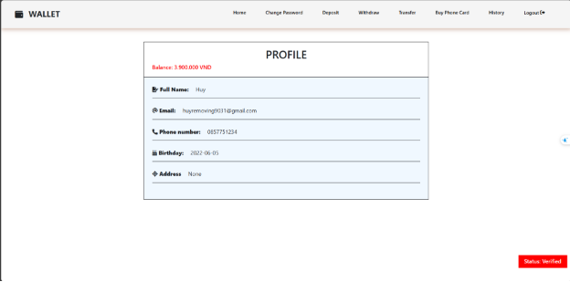
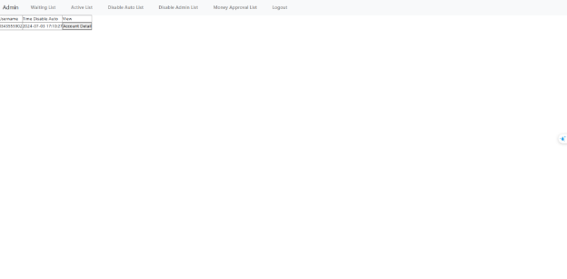
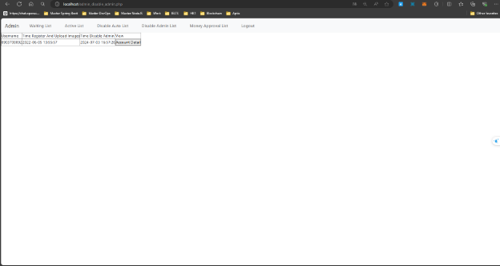

This project is made by:

TIÊN PHÚ HUY - 520H0537 

NGUYỄN TIẾN PHÁT - 520H0564

NGUYỄN THÀNH SƠN - 520H0574 

**0. Available accounts:**

For admin:

account: root  password: root

For users:

account1: 0857751234	password: huy

account2: 0343555902	password: son

account3: 0903700092 password: phat

**1. Description of the site: http://localhost:8888/**

Run xampp: Apache, MySQL.

Go to MySQL (http://localhost:8888/).

Create a database with the name "database".

Upload the attached database.sql file.

**2. Description of the site: http://localhost:8080/register.php**

Register an account for a user:

Step 1: The user fills in all information to register for a user account, the information in turn is:

`	`+ Phone number: Minimum 10 numbers, must not be the same as the phone number used for registration.

`	`+ Email : Must be in the correct format, must not be the same as the phone number used to register.

`	`+ Full name: Full name of the user

`	`+ Date of Birth: Select the user's date of birth, the format will be displayed as day/month/year

`	`+ Address: User's address

`	`+ Below you need to select a photo of your ID card of both the front and back to verify the information.

Step 2: After filling in correct and sufficient information, click Register to create an account. 

Step 3: A random account name and password will be displayed on the screen, and users will also receive gmail sending their registered account and password.

Recover password (Due to user forgetting password):

Step 1: Click Reset password on the Registration page to start changing the password. The user will be redirected to the Reset Password page.

Step 2: Fill in one of the two information: Phone number or mail of the account that has lost the password and click Next.

Step 3: A message of successful mail delivery will be displayed, the user will also receive an email with an OTP code for authentication.

Step 4: Within 1 minute, the user must enter the correct OTP code sent to email, enter the new password twice and click Next.

Step 5: The Success message is displayed, you have successfully changed the new password.

**3. Description of the site: http://localhost:8080/login.php**

Login:

User fills in his account and password and then clicks Login to log in.

If the user is successfully logged in, they will be directed to the Index page

First time login:

If this is your first time logging in, you will have to change your password at http://localhost:8080/first_login.php

Enter the new password twice and press Change to change the password

**4. Description of the site: http://localhost:8080/index.php**

In Index, users will have features such as: Home, Change password, Deposit, Withdraw, Transfer, Buy Phone Card, History and Log out.

Deposit, Withdraw, Transfer, Buy Phone Card, History features can only be used when the account is verified.

`	`+ Home: Clicking on this item will lead you to the main page. The main page is where the user's information will be displayed including Phone number, mail, Full Name, date of birth, Address, Balance in account and status.

`	`+ Change password: Clicking on this will take you to the place to change your password. You only need to enter your old password once and your new password twice to change your password.

`	`+ Deposit: Click here and you will go to the place to top up your account. This place will display the amount in your account, next you need to enter the exact top-up amount, card number, card expiration date, CVV and press Deposit .

`			`Your account will be increased by the amount you requested and an invoice will be generated in History. After depositing funds into your account, you should reload the page so that the funds in your account are updated.

`	`+ Withdraw: Click here and you will go to the place to withdraw money to the card. This place will display the amount in your account, next you need to enter the exact withdrawal amount, card number, card expiration date, CVV and click Withdraw .

`			`Your account will be reduced by the amount you requested and an invoice will be generated in History. After withdrawing money to your card, you should reload the page so that the amount in your account is updated.

`			`For transactions larger than 5,000,000 VND, you need to wait for the admin's permission to complete the transaction

`	`+ Transfer: Click here and you will go to the place to transfer money to another account. Next, you need to enter the exact recipient's phone number, transfer amount, message, OTP, select the transaction fee paid by you or the recipient and click Transfer . 

`			`Your account will be reduced by the amount you requested, the receiving account will also increase by the same amount and an invoice will be generated in the History of both parties. After transferring money, you should reload the page so that the amount in your account is up to date.

`			`For transactions larger than 5,000,000 VND, you need to wait for the admin's permission to complete the transaction

`	`+ Buy Phone Card: Click here and you will go to the place to buy a phone card. The amount in your account will be displayed on the top, next you need to enter the exact phone card brand, quantity and value of the scratch card.

`			`Your total amount will be deducted from your account and an invoice will be generated in your History. After transferring money, you should reload the page so that the amount in your account is up to date.

`	`+ History: This is where the user's transactions are saved. The user can select View to review the specific information of each transaction.

`	`+ Log out: Click here and you will log out of your account and return to the Login page.

**5. Description of the site: http://localhost:8080/admin.php**

Login with username and password as "root" at http://localhost:8080/admin\_login.php

In the main page, users will have features such as: Waiting, Active, Disable Auto, Disable Admin, Money Approval.

`	`+ Waiting : This section will leave information of accounts waiting for verification. The information includes Username, Time Register And Upload Images, Time Disable Admin and View. 

`			`When you select View admin, you will be able to see all the user's information and can perform operations for the user account. 

`			`Verification will verify the user's account, Cancel will freeze the account when the admin sees something unusual and Request for Additional Information will send information asking the user to send back the ID photo.

`	`+ Active : This section will put information of verified accounts. The information includes Username, Time Register And Upload Images, Time Disable Admin and View. 

`			`When selecting View admin will see all user information and can view information about account transactions.

`	`+ Disable Auto: This section will leave the information of the accounts that have been locked due to entering the wrong password 6 times. The information includes Username, Time Register And Upload Images, Time Disable Admin and View. 

`			`When you select View admin, you will be able to view all user information, account transaction information and be able to unlock the account.

`	`+ Disable Admin: This section will leave information of accounts that have been locked by admin. The information includes Username, Time Register And Upload Images, Time Disable Admin and View. 

`			`When selecting View admin will see all user information.

`	`+ Money Approval: This section will contain information of all pending transactions. The information includes Type, Amount, Time, Status and View. When selecting View admin will be able to see all transaction information and approval rights.

